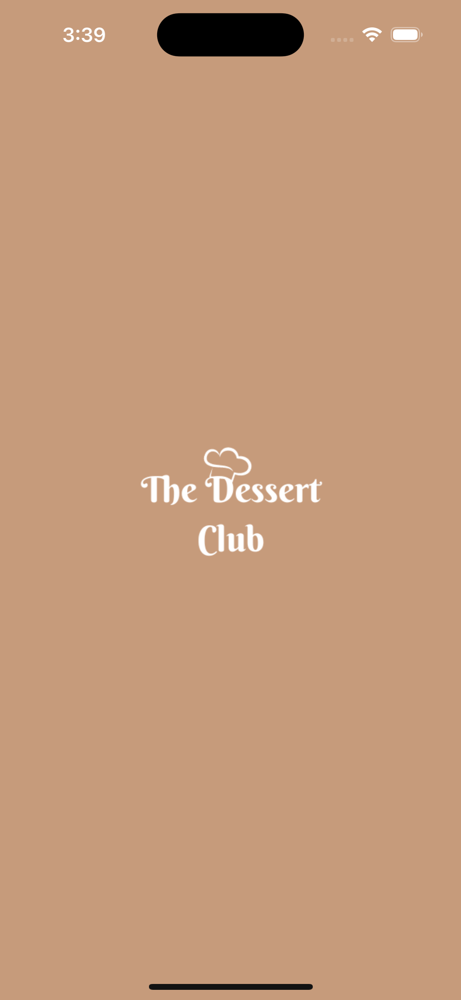
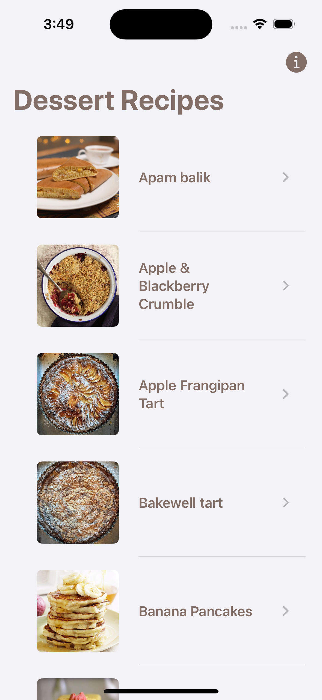
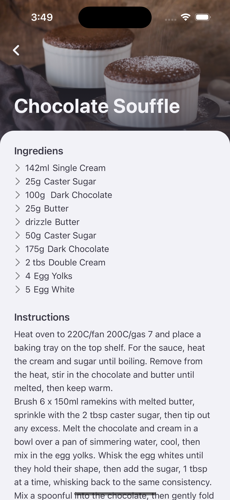
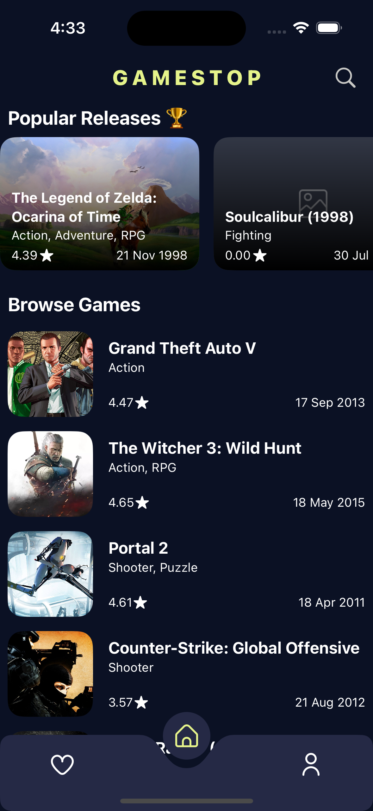
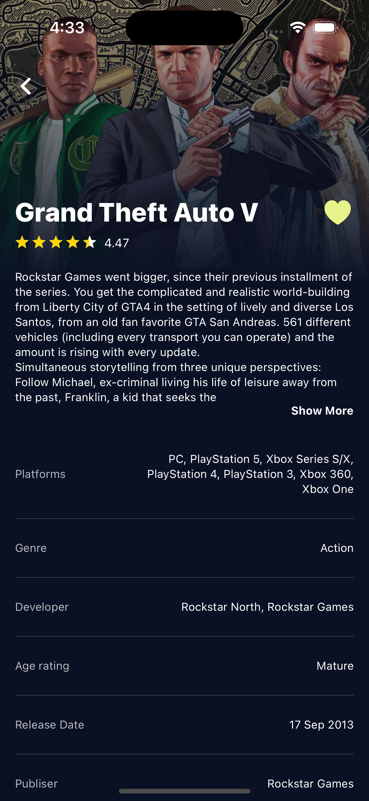
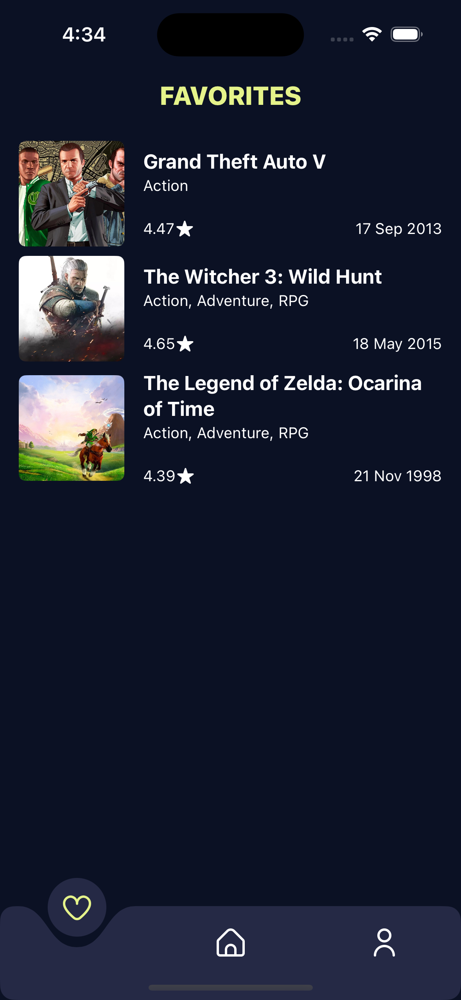
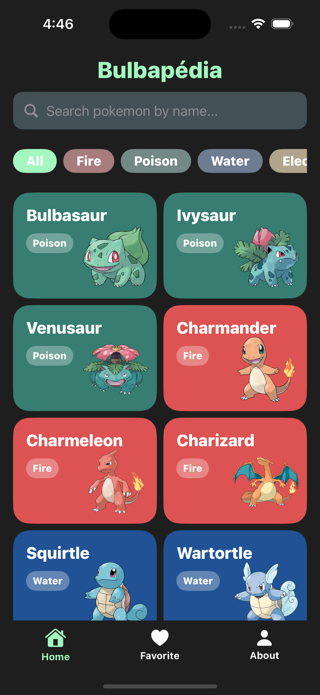
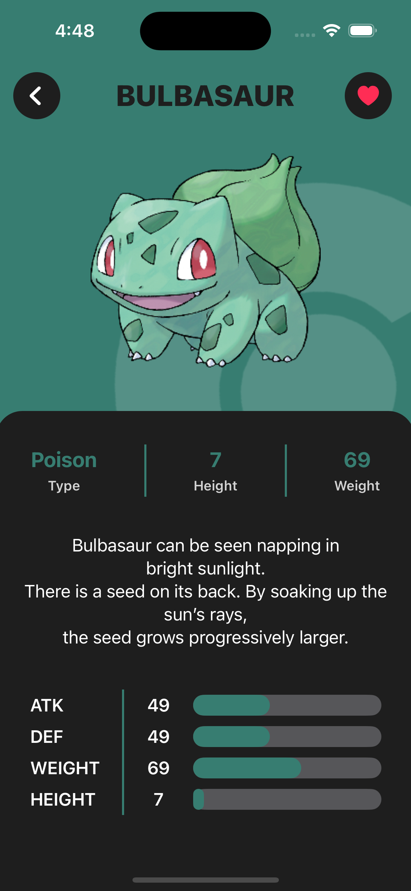
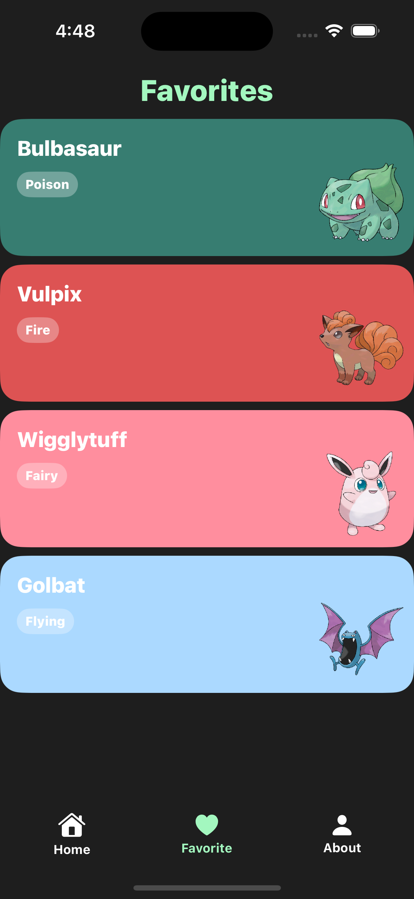

# The Dessert Club
The Dessert Club is a desert recipes application that I developed as a final project for my Dicoding class of "Belajar Membuat Aplikasi iOS untuk Pemula".
The Dessert Club is natively developed using Swift and SwiftUI. This application will display a list and detail of various dessert recipes using the TheMealDB open-source API (https://www.themealdb.com/api.php).

&nbsp;&nbsp;&nbsp;&nbsp;&nbsp;&nbsp;&nbsp;&nbsp;&nbsp;&nbsp;

Repository Link: https://github.com/aureliayacob/TheDessertClub  
Publication: Not available for now
  
# Gamestop
Gamestop is an application that I developed as a final project for my Dicoding class of "Belajar Fundamental Aplikasi iOS".
Gamestop is natively developed using Swift and SwiftUI. This application will display a list of popular releases games. Here i'm using the RAWG open-source API (https://rawg.io/apidocs).

&nbsp;&nbsp;&nbsp;&nbsp;&nbsp;&nbsp;&nbsp;&nbsp;&nbsp;&nbsp;

Repository Link: https://github.com/aureliayacob/GameStop  
Publication: Not available for now
  
# Bulbapédia
Bulbapédia is an application that I developed as a final project for my Dicoding expert class of "Menjadi iOS Developer Expert".

&nbsp;&nbsp;&nbsp;&nbsp;&nbsp;&nbsp;&nbsp;&nbsp;&nbsp;&nbsp;

Repository Link: https://github.com/aureliayacob/Bulbapedia  
Publication: Not available for now
