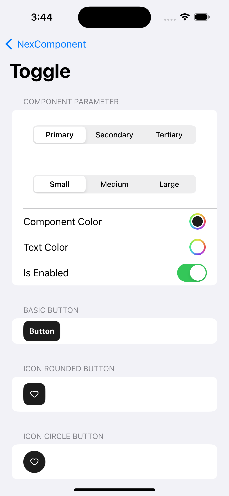

# GroUp
Super Apps application for social media, market place, logistics, etc. With a B2B business for business purposes with vendor companies and other business organizations such as manufacturers and wholesalers or wholesalers and retailers.  
Repository Link: Not available  
Publication: Not available for now

# NexComponent
NexComponent is a library that contains a collection of company's standard components that is reusable and can be used by other iOS Developer to simplify and accelerate the application development process in alignment with company standards and maximizing productivity and ensuring consistent quality across projects.

&nbsp;&nbsp;&nbsp;&nbsp;&nbsp;&nbsp;&nbsp;&nbsp;&nbsp;&nbsp;

Repository Link: Not available  
Publication: Not available

# The Dessert Club
The Dessert Club is a desert recipes application that I developed as a final project for my Dicoding class of "Belajar Membuat Aplikasi iOS untuk Pemula".
The Dessert Club is natively developed using Swift and SwiftUI. This application will display a list and detail of various dessert recipes using the TheMealDB open-source API (https://www.themealdb.com/api.php).
 
Repository Link: https://github.com/aureliayacob/TheDessertClub  
Publication: Not available for now

&nbsp;&nbsp;&nbsp;&nbsp;&nbsp;&nbsp;&nbsp;&nbsp;&nbsp;&nbsp;

# Gamestop
Gamestop is an application that I developed as a final project for my Dicoding class of "Belajar Fundamental Aplikasi iOS".
Gamestop is natively developed using Swift and SwiftUI. This application will display a list of popular releases games. Here i'm using the RAWG open-source API (https://rawg.io/apidocs).
 
Repository Link: https://github.com/aureliayacob/GameStop  
Publication: Not available for now
 

&nbsp;&nbsp;&nbsp;&nbsp;&nbsp;&nbsp;&nbsp;&nbsp;&nbsp;&nbsp;

 
# Bulbapédia
Bulbapédia is an application that I developed as a final project for my Dicoding expert class of "Menjadi iOS Developer Expert".
 
Repository Link: https://github.com/aureliayacob/Bulbapedia  
Publication: Not available for now

&nbsp;&nbsp;&nbsp;&nbsp;&nbsp;&nbsp;&nbsp;&nbsp;&nbsp;&nbsp;

